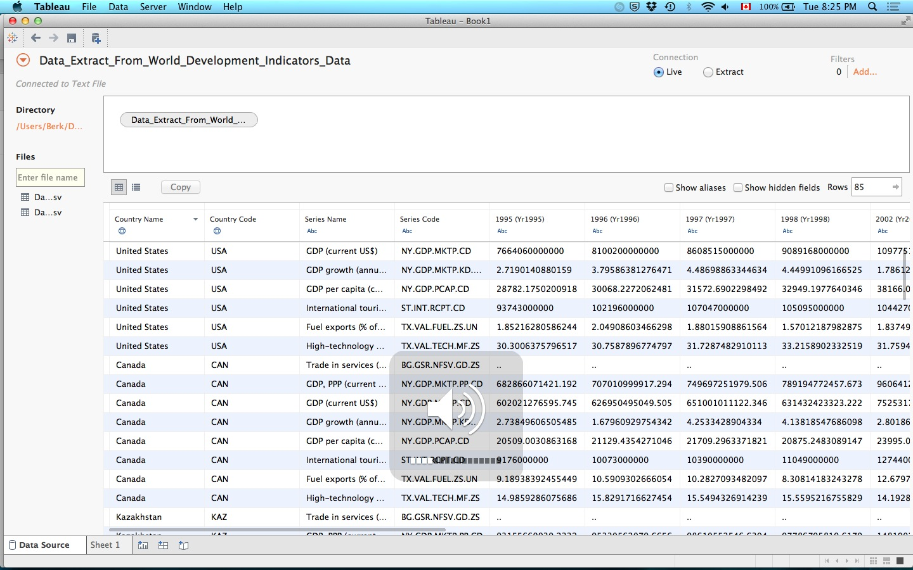
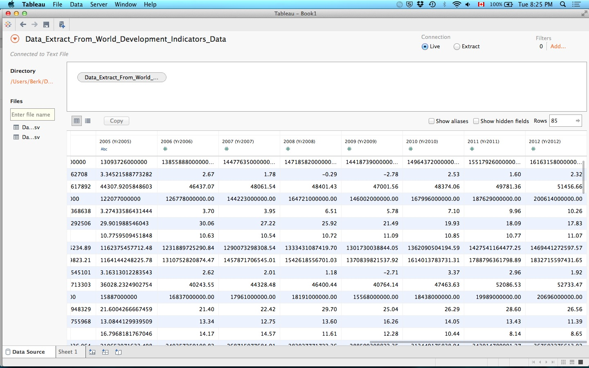

#Exploring The World Bank Database
October 27, 2015
Berk Kirikoglu


###Introduction
#####For my project, I chose to put my R and Tableau skills to the test by demonstrating my skills in the areas of data mining, data analytics, and data visualization. I undertook the challenge to discover and explore the economic data of countries across the 4 major continents: North America, Latin America, Europe and Asia. The purpose of this report is to outline the methodology used to approach this task and record the findings as a result of the task undertaken


###Part 1
#####1. Load packages

```r
library(WDI)
library(plyr)
library(dplyr)
library(ggplot2)
```

#####2. Update data from WDI (World Data Index by The World Bank)

```r
new_cache = WDIcache()
WDIsearch('gdp', cache=new_cache)
```

#####3. Search WDI for GDP data

```r
WDIsearch("GDP, current US")
```

#####Note: ISO 3166-1 alpha-2 codes for WDI package input - Greece (GR), Jamaica (JM), Canada (CA), Hong Kong (HK), Kazakhstan (KZ)
#####4. Download data "GDP, current US$, millions"

```r
dat = WDI(indicator='NY.GDP.MKTP.CD', country=c('GR','JM','CA','HK','KZ','US'), start=1960, end=2014)
```

#####5. Examine data

```r
head(dat)
```

```
##   iso2c country NY.GDP.MKTP.CD year
## 1    CA  Canada             NA 2014
## 2    CA  Canada   1.826769e+12 2013
## 3    CA  Canada   1.821445e+12 2012
## 4    CA  Canada   1.778632e+12 2011
## 5    CA  Canada   1.614072e+12 2010
## 6    CA  Canada   1.370839e+12 2009
```

###Part 2 - Downloading the Data
#####1. Download data "GDP (current US$)"
```r
dat1 = WDI(indicator='NY.GDP.MKTP.CD', country=c('GR','JM','CA','HK','KZ','US','TR','BR','CN','TH','DE'), start=1995, end=2012)
```
#####1.1. Rename column to GDP (current US$)
```r
colnames(dat1)[colnames(dat1)=="NY.GDP.MKTP.CD"] <- "GDP (current US$)"
```
#####2. Download data "International tourism receipts (current US$)"

```r
dat2 = WDI(indicator='ST.INT.RCPT.CD', country=c('GR','JM','CA','HK','KZ','US','TR','BR','CN','TH','DE'), start=1995, end=2012)

colnames(dat2)[colnames(dat2)=="ST.INT.RCPT.CD"] <- "Tourism Receipts (current US$)"

```
#####3. Download data "Trade in services (% of GDP)"
```r
dat3 = WDI(indicator='BG.GSR.NFSV.GD.ZS', country=c('GR','JM','CA','HK','KZ','US','TR','BR','CN','TH','DE'), start=1995, end=2012)

colnames(dat3)[colnames(dat3)=="BG.GSR.NFSV.GD.ZS"] <- "Trade in services (% of GDP)"
```

#####4. Download data "GDP growth (annual %)"
```r
dat4 = WDI(indicator='NY.GDP.MKTP.KD.ZG', country=c('GR','JM','CA','HK','KZ','US','TR','BR','CN','TH','DE'), start=1995, end=2012)

colnames(dat4)[colnames(dat4)=="NY.GDP.MKTP.KD.ZG"] <- "GDP growth (annual %)"
```

#####5. Download data Fuel exports (% of merchandise exports)
```r
dat5 = WDI(indicator='TX.VAL.FUEL.ZS.UN', country=c('GR','JM','CA','HK','KZ','US','TR','BR','CN','TH','DE'), start=1995, end=2012)

colnames(dat5)[colnames(dat5)=="TX.VAL.FUEL.ZS.UN"] <- "Fuel exports (% of merchandise exports)"
```
#####6. Download data High-technology exports (% of manufactured exports)
```r
dat6 = WDI(indicator='TX.VAL.TECH.MF.ZS', country=c('GR','JM','CA','HK','KZ','US','TR','BR','CN','TH','DE'), start=1995, end=2012)

colnames(dat6)[colnames(dat6)=="TX.VAL.TECH.MF.ZS"] <- "High-technology exports (% of manufactured exports)"
```
###Part 3
#####1. Combine all datasets into one
```r
abc <- inner_join(dat1, dat2)
abc1 <- inner_join(abc, dat3)
abc2 <- inner_join(abc1, dat4)
abc3 <- inner_join(abc2, dat5)
abc4 <- inner_join(abc3, dat6)
```
#####2. Convert the dataset into a csv
```r
write.csv(abc4, "WorldBank_data4Tableau2.csv")
```

###Part 4 -Explore the data set in Tableau
#####My Tableau work is on github the file name is Book1DATA


###Findings
#####As seen in the tableau demonstration I have identified 2 occasions of a global economic crises in 1998, 2008. As explained I observed the impact of these crises in the global tourism, fuel and technology indrustries. A general trend can be seen within different industries and how they respond to an economic crises. For example Tourism is more volatile during recessions compared to Fuel and Tech exports. Also the region the Crises orginates in was apperent as Thailand and Asia was mostly affected in 1998 however USA and North America was highly affected followed by Europe and Latin America and it the economic downturn affected Asia slightly. 
####Tourism
#####though the dashboards in tableau it can be seen that in 1998 the most affected country is Thailand. Tourism in Asia and Latin America is relatively slowed down where as North America and Europe did not experince any decline in tourism income. The trend supports the fact that the 1998 crisis originated in Thailand. In 2008 where the crisis originated in the US, not surprisingly was the country and region most affected in terms of tourism income. Followed by slowed down incomes in Latin America and Europe. Whereas Asia was the least affected. 
####Fuel Exports
##### Fuel kept a more consistent trend compared to tourism. This can be associated to the fact that tourism is a luxury good where as fuel is not. In 1998 Fuel kept consistent values however in 2008 it can be observed that Asia performed much bettter in fuel exports compared to other continents. 
####Tech Exports
##### Tech behaved similiar to Fuel. In 1998 the industry was immune to the recession and in 2008 it was strong worldwide except in the US.

###Challenges & Comments
#####Data is very unorginized and even when it is it might now be how you want it to be. Although initialy I wanted to make a project about Sports the data was overwhelmingly unorginized so I turned to the World Bank Database which I knew it be easier to extract however I encountered many struggles there as well, as the data was not the way I wanted it at all after stuggling with excel, google refine and tableau for a long time I had to find an api for the WorldBank Database in R loaded all the data from there merged it and exported into tableau where I did my discoveries. Overall I definetly used various skills on this projects such as data mining, data analytics, and data visualization. 
### Review
#####If I were to improve upon this project I'd definetly tackle the questions more using scatter plots and maybe add in some heat maps and demonstrate changes over time in different regions. The data is quite rich and many conclusion can be made from it and a variety of different plots and analytic tools can be applied to examine further. 

###Exibit A of the unorganized data initially
 

